<div align="center">


# لطيف جي ٻولي — Latif Ji Boli
### The World's First Sindhi Programming Language

**A Java / Spring Boot compiler-interpreter backend that lets people write real, executable programs using native Sindhi script — fusing Shah Abdul Latif's poetic heritage with modern software engineering.**

[](#tech-stack)
[](#tech-stack)
[](#tech-stack)
[](#license)
[](#-academic-context)

[🌐 Live Web IDE](https://muhammad-muzamil1.github.io/SindhiProgrammingLanguage/) · [📖 Documentation](#-language-guide) · [🚀 Getting Started](#-getting-started) · [📊 Performance](#-performance--load-testing)

</div>

<p align="center">
  
</p>

## 📜 Table of Contents

- [About the Project](#-about-the-project)
- [Why "Latif Ji Boli"?](#-why-latif-ji-boli)
- [Key Features](#-key-features)
- [System Architecture](#-system-architecture)
- [Tech Stack](#-tech-stack)
- [Language Guide](#-language-guide)
  - [Keywords & Syntax](#keywords--syntax)
  - [Code Examples](#code-examples)
  - [Sindhi vs C vs Java](#sindhi-vs-c-vs-java)
- [Project Structure](#-project-structure)
- [REST API Reference](#-rest-api-reference)
- [Security & Reliability](#-security--reliability)
- [Performance & Load Testing](#-performance--load-testing)
- [Getting Started](#-getting-started)
- [Project Poster](#-project-poster)
- [Academic Context](#-academic-context)
- [Roadmap](#-roadmap)
- [Team](#-team)
- [License](#-license)

---

## 🎯 About the Project

**Latif Ji Boli** (لطيف جي ٻولي — *"Latif's Language"*) is a custom-built, fully interpreted programming language whose keywords, operators, and error messages are written entirely in the **Sindhi script**. Instead of forcing native Sindhi speakers to first learn English syntax before they can learn to code, this project flips the script (literally) — learners write `لک`, `جيڪڏ`, `جيستائين`, and `لکيوَ` instead of `let`, `if`, `while`, and `print`.

This repository contains the **backend engine**: a hand-written **lexer**, **recursive-descent parser/interpreter**, and a **Spring Boot REST API** that compiles and executes Sindhi source code on demand, paired with a bundled RTL web-based code editor (IDE) for trying it out directly in the browser.

> *"جي سڄڻ سان نيهه لڳو، تن جو ڪجھ به نه وڃي، جيئن سمنڊ ۾ وهي وڃن، سدائين موتي ٿين"* — a verse of Shah Abdul Latif Bhittai, displayed on the IDE's welcome screen, anchoring the project in Sindhi literary heritage.

## 💡 Why "Latif Ji Boli"?

- 🗣️ **Language preservation** — helps digitally preserve and modernize the Sindhi language in the age of software.
- 🎓 **Lower the barrier to entry** — students in rural and native Sindhi-speaking communities can grasp programming logic (variables, conditionals, loops) without an English-language barrier.
- 🕌 **Cultural + technical fusion** — bridges Shah Abdul Latif's poetry with computer science education.
- 🚀 **A real, working compiler pipeline** — not a toy: it has a proper lexer, token stream, recursive-descent interpreter, typed variables, operator precedence, and structured error reporting — all built from scratch in Java, with no parser-generator libraries.

## ✨ Key Features

| Category | Details |
|---|---|
| 🈯 **Native Sindhi Syntax** | Keywords, identifiers, and runtime errors are all Sindhi/Unicode-aware (`\p{L}`, `\p{M}` regex classes, NFC normalization, BOM stripping) |
| 🔢 **Typed Variables** | `عددي` (Integer) and `لکت` (String) declarations with runtime type checking |
| 🔀 **Control Flow** | `جيڪڏ / ته جيڪڏ / نه` (if / else-if / else), `جيستائين` (while), `ڪر...جيستائين` (do-while) |
| ➕ **Full Expression Engine** | Operator-precedence parsing for arithmetic (`+ - * / %`), comparison, logical `۽`/`يا` (AND/OR), string concatenation, and the ternary operator (`? :`) |
| 🖨️ **Output Statements** | `لکيوَ` (print) with automatic type-to-string coercion |
| 🛡️ **Sandboxed Execution** | Each request runs on a pooled worker thread with an **8-second timeout guard** to kill infinite loops / runaway code |
| 🌐 **Web IDE Included** | A bundled RTL (right-to-left) single-page code editor, live output console, and full bilingual documentation page — no separate frontend repo needed |
| 🔐 **Production-grade Security** | Spring Security filter chain + custom **Bucket4j token-bucket rate limiter** (20 requests/min per IP) |
| 📈 **Battle-tested Performance** | Load tested with **1.47M+ requests** via Apache JMeter (see [Performance](#-performance--load-testing)) |
| 📄 **API Docs Built-in** | Auto-generated OpenAPI / Swagger UI via `springdoc-openapi` |
| ❤️ **Health Monitoring** | Spring Boot Actuator health endpoint for uptime checks |

## 🏗️ System Architecture

The engine follows a classic **layered compiler pipeline** wrapped inside a layered Spring Boot architecture:

```mermaid
flowchart LR
    subgraph Client["🖥️ Client"]
        A[Web IDE / Browser<br/>index.html + script.js]
    end

    subgraph Security["🛡️ Security Layer"]
        B[RateLimitingFilter<br/>Bucket4j — 20 req/min per IP]
        C[SecurityConfig<br/>Spring Security Filter Chain]
    end

    subgraph Presentation["🌐 Presentation Layer"]
        D["SindhiProgrammingController<br/>POST /SindhiLanguage/v1"]
    end

    subgraph Service["⚙️ Service Layer"]
        E[SindhiProgrammingInterpreterServices<br/>Thread-pooled execution + 8s timeout]
    end

    subgraph Compiler["🧠 Compiler Core"]
        F[SindhiLexer<br/>Regex tokenizer, Unicode-aware]
        G[SindhiToken<br/>Type · Value · Line · Column]
        H[SindhiInterpreter<br/>Recursive-descent parser + evaluator]
        I[SindhiValue<br/>Typed runtime value wrapper]
    end

    A -- "JSON: { sindhiCode }" --> B
    B --> C
    C --> D
    D --> E
    E --> F
    F --> G
    G --> H
    H --> I
    H -- "Output / غلطي (error)" --> D
    D -- "JSON Response" --> A
```



**How code execution works, step by step:**

1. **Lexer** (`SindhiLexer`) scans the raw Sindhi source, normalizes Unicode (NFC) and strips BOM, then tokenizes it into `COMMENT`, `STRING`, keyword, `NUMBER`, `OPERATOR`, and `IDENTIFIER` tokens using ordered regex rules (comments and strings are matched before keywords to avoid ambiguity, and keywords use negative lookahead `(?!\p{L})` so they aren't partially matched inside longer identifiers).
2. **Interpreter** (`SindhiInterpreter`) is a hand-rolled **recursive-descent parser** that walks the token stream directly and evaluates as it parses — no separate AST pass. It implements a full operator-precedence chain: `ternary → logical OR → logical AND → equality → comparison → addition/subtraction → multiplication/division/modulo → primary`.
3. **Type system**: variables are declared with an explicit type (`عددي`/`لکت`) and coerced on every assignment; runtime errors return descriptive, line/column-aware Sindhi-and-English error messages.
4. **Execution isolation**: the `ServiceLayer` submits every incoming program to a cached thread pool and enforces a hard **8-second timeout**, protecting the server from infinite `جيستائين` loops.
5. **Delivery**: results (or a `غلطي:` error message) are returned as plain text/JSON to the frontend's fetch call and rendered in the RTL output console.

## 🧰 Tech Stack

<div align="center">

| Layer | Technology |
|---|---|
| **Language** |  |
| **Backend Framework** |  (Web, Security, Validation, Actuator) |
| **Build Tool** |  |
| **Rate Limiting** | Bucket4j 8.10.1 (token-bucket algorithm) |
| **API Documentation** | springdoc-openapi-starter-webmvc-ui 2.5.0 (Swagger UI) |
| **Boilerplate Reduction** | Lombok |
| **Frontend (bundled)** | Vanilla **HTML5 / CSS3 / JavaScript**, RTL layout, custom Nastaliq/Noto Sans Arabic fonts |
| **Testing** | Spring Boot Test, Spring Security Test |
| **Load Testing** | Apache JMeter |
| **TLS / Certificates** | PKCS12 keystore + Let's Encrypt (production) |
| **Deployment** | Railway (Nix/Maven build pipeline) |

</div>

## 📖 Language Guide

### Keywords & Syntax

| Sindhi Keyword | Meaning | English Equivalent |
|---|---|---|
| `لک` | Declare a new variable | `let` / `var` |
| `عددي` | Integer type | `int` |
| `لکت` | String type | `String` |
| `جيڪڏ` | Conditional | `if` |
| `ته جيڪڏ` | Else-if branch | `else if` |
| `نه` / `ته` | Else branch | `else` |
| `جيستائين` | While loop | `while` |
| `ڪر ... جيستائين` | Do-while loop | `do { } while` |
| `لکيوَ` | Print output | `print` / `System.out.println` |
| `۽` | Logical AND | `&&` |
| `يا` | Logical OR | `\|\|` |
| `< > <= >=` | Comparison operators | same |
| `+ - * / %` | Arithmetic operators | same |
| `+` (on strings) | String concatenation | `+` |
| `? :` | Ternary operator | `? :` |
| `//` | Single-line comment | `//` |

### Code Examples

**Hello, World! (with variables)**
```
لک لکت نالو = "مزمل"
لکيوَ "سلام، " + نالو
```

**Grading with if / else-if / else**
```
لک عددي اسڪور = 85
جيڪڏ اسڪور >= 90 {
    لکيوَ "عالي"
} ته جيڪڏ اسڪور >= 80 {
    لکيوَ "وڏا"
} ته {
    لکيوَ "سٺو"
}
```

**Sum 1 to 100 with a while loop**
```
لک عددي مجموعو = 0
لک عددي n = 1
جيستائين n <= 100 {
    مجموعو = مجموعو + n
    n = n + 1
}
لکيوَ "1 کان 100 تائين مجموعو: " + مجموعو
```

**Do-while countdown**
```
لک عددي x = 5
ڪر {
    لکيوَ x
    x = x - 1
} جيستائين x > 0
```

**Fibonacci sequence (first 10 numbers)**
```
لک عددي n = 10
لک عددي پھريون = 0
لک عددي ٻيون = 1
لک عددي ايندڙ = 0

جيستائين n > 0 {
    لکيوَ پھريون
    ايندڙ = پھريون + ٻيون
    پھريون = ٻيون
    ٻيون = ايندڙ
    n = n - 1
}
```

**Ternary operator**
```
لک عددي x = 5
لکيوَ x > 3 ? "ھا" : "نه"
```

### Sindhi vs C vs Java

| Concept | Sindhi Programming | C | Java |
|---|---|---|---|
| Declare a variable | `لک عددي x = 5` | `int x = 5;` | `int x = 5;` |
| String variable | `لک لکت نالو = "Muhammad Muzamil"` | `char name[] = "Muhammad Muzamil";` | `String name = "Muhammad Muzamil";` |
| Print | `لکيوَ نالو` | `printf("%s", name);` | `System.out.println(name);` |
| Conditional | `جيڪڏ x > 5 { ... }` | `if (x > 5) { ... }` | `if (x > 5) { ... }` |
| Loop | `جيستائين x <= 5 { ... }` | `while (x <= 5) { ... }` | `while (x <= 5) { ... }` |

*(Full comparison table with 10+ rows is available in the in-app documentation page.)*

## 📁 Project Structure

```
Sindhi_Programming_Language_Backend/
├── src/
│   ├── main/
│   │   ├── java/com/example/SindhiProgrammingLanguage/
│   │   │   ├── Compiler/
│   │   │   │   ├── SindhiLexer.java              # Tokenizer / regex-based lexer
│   │   │   │   ├── SindhiToken.java              # Token model (type, value, line, column)
│   │   │   │   ├── SindhiInterpreter.java        # Recursive-descent parser + evaluator
│   │   │   │   └── SindhiValue.java              # Typed runtime value wrapper
│   │   │   ├── PresentationLayer/
│   │   │   │   └── SindhiProgrammingController.java   # REST controller (POST /SindhiLanguage/v1)
│   │   │   ├── SecurityLayer/
│   │   │   │   ├── SecurityConfig.java           # Spring Security filter chain
│   │   │   │   └── RateLimitingFilter.java       # Bucket4j IP-based rate limiter
│   │   │   ├── ServiceLayer/
│   │   │   │   └── SindhiProgrammingInterpreterServices.java  # Thread-pooled, timeout-guarded execution
│   │   │   ├── SindhiCodeRequest.java            # Request DTO
│   │   │   └── SindhiProgrammingLanguageApplication.java      # Spring Boot entry point
│   │   └── resources/
│   │       ├── application.properties
│   │       ├── keystore.p12                      # TLS keystore
│   │       └── static/                           # Bundled Web IDE (frontend)
│   │           ├── index.html                    # Welcome / Editor / Docs pages (RTL, SEO-optimized)
│   │           ├── script.js                     # Editor logic + fetch() calls to the API
│   │           ├── styles.css                    # Ajrak-inspired theme
│   │           └── assets/
│   │               ├── fonts/mb sania.ttf
│   │               └── images/{sindhLogo.JPG, sindhi-ajrak-pattern.jpg}
│   └── test/java/.../SindhiProgrammingLanguageApplicationTests.java
├── Latif Ji Boli Acedamic Work/                  # Thesis, poster, final presentation
├── Latif Ji Boli API Performance/                # JMeter load-test reports
├── pom.xml
└── mvnw / mvnw.cmd
```

## 🔌 REST API Reference

Interactive Swagger UI is available at **`/swagger-ui.html`** once the app is running.

### Execute Sindhi Code

```
POST /SindhiLanguage/v1
Content-Type: application/json
```

**Request Body**
```json
{
  "sindhiCode": "لک لکت نالو = \"مزمل\"\nلکيوَ \"سلام، \" + نالو"
}
```

**Success Response — `200 OK`**
```
سلام، مزمل
```

**Error Response — `400 Bad Request`**
```
غلطي: Variable 'x' not declared at line 2, column 1
```

**cURL Example**
```bash
curl -X POST https://<your-host>/SindhiLanguage/v1 \
  -H "Content-Type: application/json" \
  -d '{"sindhiCode": "لک عددي x = 10\nلکيوَ x"}'
```

**Other useful endpoints**

| Endpoint | Purpose |
|---|---|
| `GET /actuator/health` | Service health check (Actuator) |
| `GET /swagger-ui.html` | Interactive API documentation |
| `GET /v3/api-docs` | Raw OpenAPI 3 spec |

## 🔐 Security & Reliability

- **Spring Security filter chain** (`SecurityConfig`) — CSRF disabled for the stateless API, `frameOptions` same-origin, and explicit `permitAll()` allow-lists for the API endpoint, actuator health, Swagger UI, and static frontend assets — everything else requires authentication.
- **Custom IP-based rate limiting** (`RateLimitingFilter`) — implemented with **Bucket4j**, allowing **20 requests per minute per client IP** via a classic token-bucket (`Bandwidth.classic(20, Refill.intervally(20, 1 min))`), returning HTTP `429` on excess.
- **Execution sandboxing** — every interpreted program runs inside a `Future` on a cached thread pool with a strict **8-second timeout**; runaway/infinite loops are interrupted and return a friendly Sindhi timeout message instead of hanging the server.
- **TLS** — shipped with a PKCS12 keystore and configured for HTTPS via Let's Encrypt certificates in production.
- **Input validation** — `spring-boot-starter-validation` guards the request DTO layer.

## 📊 Performance & Load Testing

The `/SindhiLanguage/v1` endpoint was stress-tested with **Apache JMeter** across a multi-service thread group (API Gateway, Document, Template, and Draft services included in the same test plan):

| Metric | Result |
|---|---|
| **Total Samples** | 1,470,511 requests |
| **Average Response Time** | 106 ms |
| **Median** | 31 ms |
| **90th Percentile** | 360 ms |
| **95th Percentile** | 911 ms |
| **99th Percentile** | 1,038 ms |
| **Min / Max Latency** | 0 ms / 1,711 ms |
| **Error Rate** | 0.06% |
| **Throughput** | 8,299.6 requests/sec |
| **Received / Sent** | 2,903.24 KB/sec / 2,843.09 KB/sec |

> Full JMeter Summary Report and Aggregate Report screenshots are available in [`Latif Ji Boli API Performance/`](<./Latif Ji Boli API Performance/>).

<div align="center">

</div>

## 🚀 Getting Started

### Prerequisites
- **Java 21+**
- **Maven** (or use the bundled `./mvnw` wrapper)

### Clone & Run

```bash
# Clone the repository
git clone https://github.com/Muhammad-Muzamil1/Sindhi_Programming_Language_Backend.git
cd Sindhi_Programming_Language_Backend

# Run with the Maven wrapper
./mvnw spring-boot:run
```

The app starts on **`http://localhost:8080`** by default:
- Web IDE → `http://localhost:8080/`
- API → `http://localhost:8080/SindhiLanguage/v1`
- Swagger → `http://localhost:8080/swagger-ui.html`

### Build a JAR
```bash
./mvnw clean package
java -jar target/SindhiProgrammingLanguage-0.0.1-SNAPSHOT.jar
```

### Try it instantly
Write this in the bundled editor and hit **هلايو** (Run):
```
لک عددي عمر = 22
لکيوَ عمر
```

## 🖼️ Project Poster

<div align="center">

</div>

The full **thesis document** and **final presentation deck** are also included under [`Latif Ji Boli Acedamic Work/`](<./Latif Ji Boli Acedamic Work/>).

## 🎓 Academic Context

This project is submitted as a **Final Year Project (FYP)** for the **BS Software Engineering** program at:

> **Quaid-e-Awam University of Engineering, Science & Technology (QUEST), Nawabshah**
> Department of Software Engineering

| Role | Name | Roll No. |
|---|---|---|
| Group Leader | **Muhammad Muzamil** | 22SW30 |
| Assistant Group Leader | Ali Yawar | 22SW43 |
| Assistant Group Leader | Ahsan Abbas | 22SW12 |
| **Supervisor** | **Dr. Ali Raza Bhangwar** | — |

**Applications highlighted in the FYP poster:**
- 🎓 **Education** — teach programming fundamentals in Sindhi in schools and colleges.
- 🔬 **Research** — promote local-language computing and NLP research for Sindhi.
- 💻 **Local Development** — a foundation for building more Sindhi-based software and dev tools.
- 🤝 **Community Empowerment** — encourage Sindhi youth to code in their mother tongue.

## 🗺️ Roadmap

- [ ] Functions / user-defined procedures
- [ ] Arrays and collection types
- [ ] For-loop syntax sugar
- [ ] Persistent script/file saving in the Web IDE
- [ ] Syntax highlighting in the code editor
- [ ] Package/module system for larger Sindhi programs
- [ ] VS Code extension for `.سنڌي` files

## 👥 Team

- **Muhammad Muzamil** — Group Leader, Backend & Compiler Engineering ([GitHub](https://github.com/Muhammad-Muzamil1))
- **Ali Yawar** — Assistant Group Leader
- **Ahsan Abbas** — Assistant Group Leader
- **Dr. Ali Raza Bhangwar** — Project Supervisor

## 📄 License

This project was developed as an academic **Final Year Project** at QUEST Nawabshah. Please contact the author before reuse in commercial or derivative academic work.

---

<div align="center">

*"سنڌي ٻولي کي ڊجيٽل دور ۾ محفوظ ڪرڻ"* — Preserving the Sindhi language in the digital era.

Made with ❤️ in Sindh, Pakistan 🇵🇰

</div>
